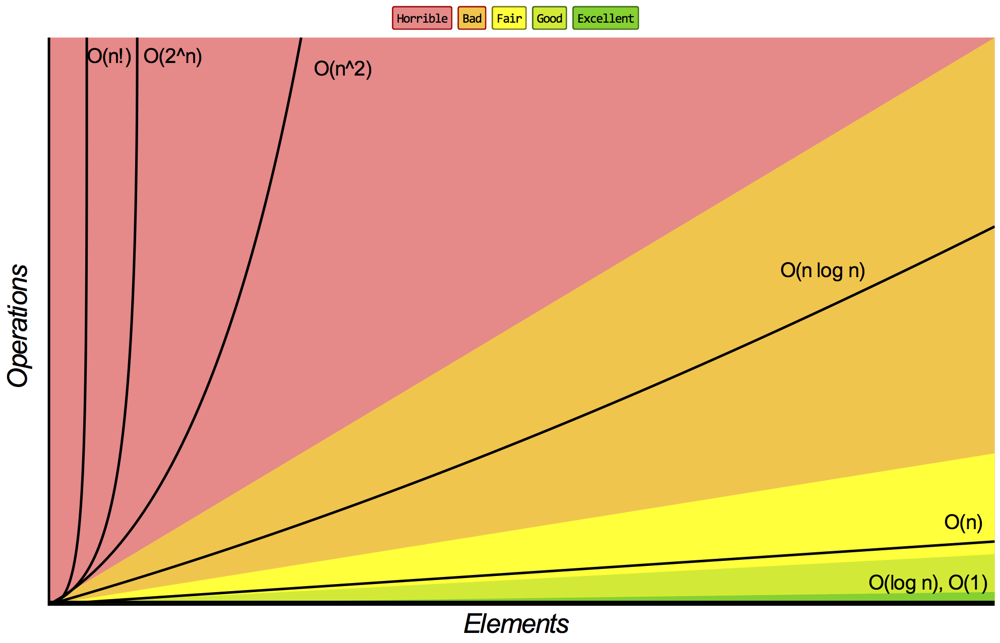

$$
\newcommand{\O}{\text{O}}
$$

For general explanations see [Summary](#summary).

# Big-$\O$ vs. Big-$\Omega$ vs. Big-$\Theta$

## Big-$\O$

- Upper bound
- Less than or equal: $\leq$

## Big-$\Omega$ (Big-Omega)

- Lower bound
- Greater than or equal: $\geq$

## Big-$\Theta$ (Big-Theta)

- Big-$\O$ **AND** Big-$\Omega$
- Tight bound

## Notes

For an algorithm for which $\O(N)$ is valid, any greater term, e.g. $\O(N^2)$, is also valid (since Big-$\O$ is an upper bound, that is, *less than or equal*).

For an algorithm for which $\Omega(N)$ is valid, any smaller term, e.g. $\Omega(1)$, is also valid (since Big-$\Omega$ is a lower bound, that is, *greater than or equal*).

However, in practice, the tightest possible bounds are usually used. That is, the smallest term for Big-$\O$ and the largest term for Big-$\Omega$.

# Rules for determining the Big-$\O$/$\Omega$/$\Theta$ term

## 1. Drop Constants

- $\O(2N)$ becomes $\O(N)$
- Because, no matter how much the constants of e.g. $2\,000\,000 N$ and $2N^2$ differ, with growing input size $N$, the latter term will eventually surpass the former one.
- We are interested in the **order of growth** only of the running time, and with large $N$, constants and non-dominant terms become relatively insignificant.

## 2. Drop Non-Dominant Terms

- $\O(N^2 + N)$ becomes $\O(N^2)$
- $\O(5\cdot2^N + 3N^{100})$ becomes $\O(2^N)$
- $\O(A^2 + B)$ stays $\O(A^2 + B)$
- Explanation, see above

## 3. Different Steps of an Algorithm are Added 

-  Two *successive* for loops taking A and B iterations, respectively: $\O(A + B)$

## 4. Nested Steps in an Algorithm are Multiplied

- Two *nested* for loops taking A and B iterations, respectively: $\O(A \cdot B)$

## 5. Use Different Variables for Different Inputs

- For example, if the input consists of two strings of length $n$ and $m$, use two variables $N$ and $M$
- For example, $\O(N + M)$

## Addtional Rules

### Base of Logarithm

The base of a logarithm **doesn't matter**: log denotes a logarithm of any base.

### Base of Exponent

The base of an exponent **matters**: $\O(2^N)$ and $\O(8^N)$ are different.

### Non-Dominant Terms in Exponent

Non-dominant terms in an exponent **don't matter**: $2^{N+1}$ becomes $\O(2^N)$.

### Constants in Exponent

Constant factors in exponents **matter**: $\O(8^N)$ and $\O(8^{2N})$ are different.

# Common Big-$\O$/$\Omega$/$\Theta$ Terms and Their Relation

{:width="100%"}{:.center-image}
*Source:&nbsp;[bigocheatsheet.com](http://bigocheatsheet.com/)*{:.caption}

$$\O(N^N) > \O(N!) > \O(2^N) > \O(N^2) > \O(N\,log\,N) > \O(N) > \O(log\,N) > \O(1)$$

# Summary

## What is it all about?

Big-$\O$/$\Omega$/$\Theta$ notation is used to express complexity bounds of an algorithm.

The term within the Big-$\O$/$\Omega$/$\Theta$ notation denotes a number of steps (time complexity) or used memory units (space complexity).

The variables within the term are are the sizes of the inputs of the algorithm.

## What's the difference between $\O$, $\Omega$, and $\Theta$?

$\O$, $\Omega$, and $\Theta$ defines what the term inside the notation means (see [here](#big-o-vs-big-omega-vs-big-theta)):

- $\O$: the real value is **less than or equal** to the notation term (the term is an upper bound)
- $\Omega$ the real value is **greather than or equal** to the notation term (the term is a lower bound)
- $\Theta$ the real value is **equal** to the notation term (the term is a tight bound)

## How to understand the term within Big-$\O$/$\Omega$/$\Theta$?

However, the Big-$\O$/$\Omega$/$\Theta$ term is not an exact term. Its purpose is to indicate an **order** rather than an exact value.

That's why we apply the rules listed [here](#rules-for-determining-the-big-o-term) to the Big-$\O$/$\Omega$/$\Theta$ term.

For example, if the tightest upper bound for an algorithms would really be $2N^2$, the Big-$\O$ term is just $\O(N^2)$. Now, if the maximum number of steps of this algorithm is exactly $2N^2$, the algorithm is still in $\O(N^2)$ (even though $2N^2 \leq N^2$ is false).

Conclusion: don't take the Big-$\O$/$\Omega$/$\Theta$ literally, but just as an indication of **order** or **category**.

# References

- Great video: [YouTube - Big O Notation](https://www.youtube.com/watch?v=v4cd1O4zkGw)
