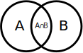

$$
\newcommand{\P}{\text{P}}
\newcommand{\Vert}{\,\vert\,}
$$

# Contents

- TOC
{:toc .toc-depth-1 .toc-skip-first}

# Illustration

{:width="20%"}{:.center-image}

# Conditional Probability

## Probability of B Given A

$$\P(B\Vert A)$$

- If $A$ occured, what is the probability that now also $B$ occurs?
- Percentage of $A$ that is also in $B$.

## Probability of A Given B

$$\P(A\Vert B)$$

- If $B$ occured, what is the probability that now also $A$ occurs?
- Percentage of $B$ that is also in $A$.

# Probability of A And B

$$
\begin{align*}
\P(A \cap B) & = \P(A) \cdot \P(B\Vert A) \\
                   & = \P(B) \cdot \P(A\Vert B)
\end{align*}
$$

# Probability of A Or B

$$\P(A \cup B) = \P(A) + \P(B) - \P(A \cap B)$$

# Conditional Probability Revisited I

## Probability of B Given A (I)

$$\P(B\Vert A) = \frac{\P(A \cap B)}{\P(A)}$$

Deduced from [this](#probability-of-a-and-b) formula for $\P(A \cap B)$.

## Probability of A Given B (I)

$$\P(A\Vert B) = \frac{\P(A \cap B)}{\P(B)}$$

Deduced from [this](#probability-of-a-and-b) formula for $\P(A \cap B)$.

# Conditional Probability Revisited II

## Probability of B Given A (II)

$$\P(B\Vert A) = \frac{\P(B) \cdot \P(A\Vert B)}{\P(A)}$$

In [this](#probability-of-b-given-a-i) formula for $\P(B\Vert A)$, replace $\P(A \cap B)$ with [this](#probability-of-a-and-b) formula for $\P(A \cap B)$.

This equation is called **Bayes' Theorem**.

## Probability of A Given B (II)

$$\P(A\Vert B) = \frac{\P(A) \cdot \P(B\Vert A)}{\P(B)}$$

In [this](#probability-of-a-given-b-i) formula for $\P(A\Vert B)$ replace $\P(A \cap B)$ with [this](#probability-of-a-and-b) formula for $\P(A \cap B)$.

This equation is called **Bayes' Theorem**.

# Independent Events

The happening of one event has no effect on the probability of the other event.

For example:

- $A$ = getting *head* on first toss of a coin
- $B$ = getting *head* on second toss of a coin

$$\P(A \cap B) = \P(A) \cdot \P(B)$$

In [this](#probability-of-a-and-b) formula for $\P(A \cap B)$, replace $\P(B\Vert A)$ with $\P(B)$.

We can do this, because if $A$ occurred, the probability that $B$ occurs is not affected by that. The probability that $B$ occurs is still $\P(B)$.

# Mutual Exclusive Events

The happening of one event prevents the happening of the other event.

For example:

- $A$ = rolling a 1 with a die
- $B$ = rolling a 2 with a die

$$\P(A \cup B) = \P(A) + \P(B)$$

In [this](#probability-of-a-or-b) formula for $\P(A \cup B)$, replace $\P(A \cap B)$ with 0.

We can do this, because events $A$ and $B$ cannot occur together (the probability that they occur together is 0).

