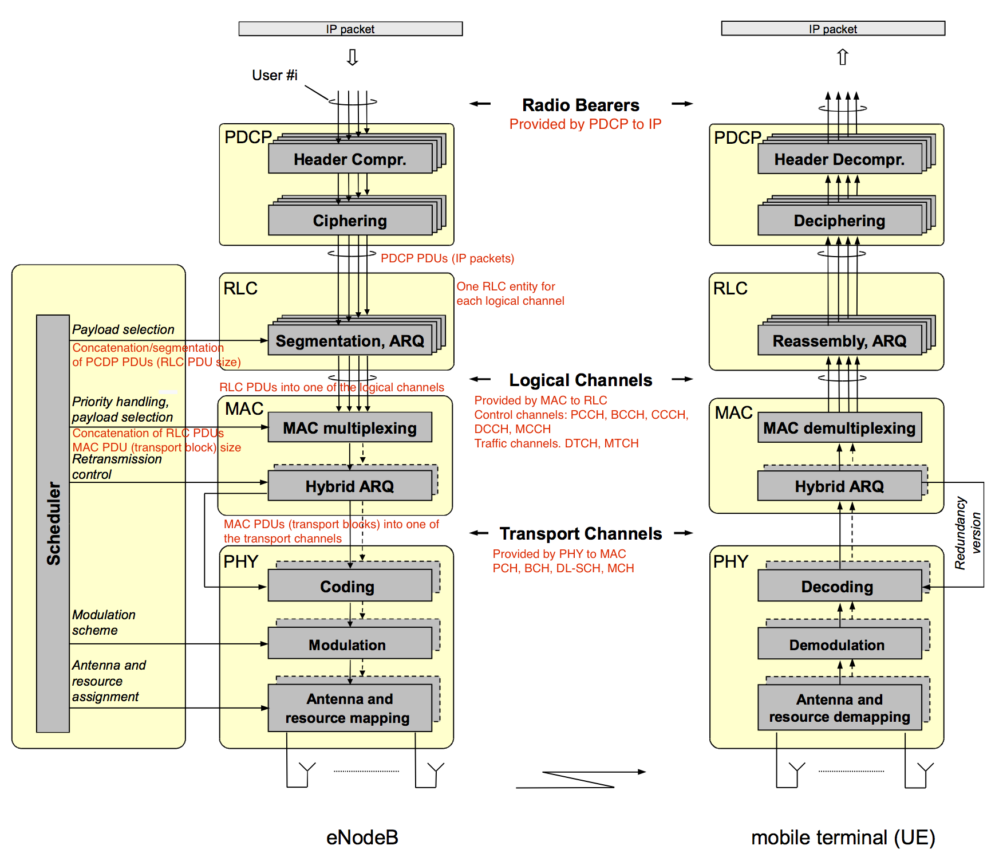
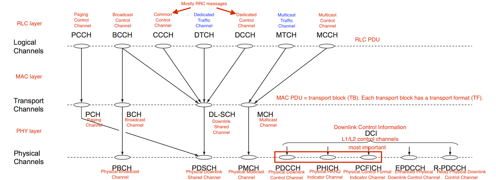
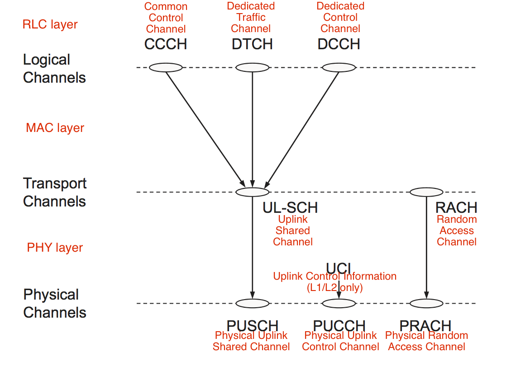
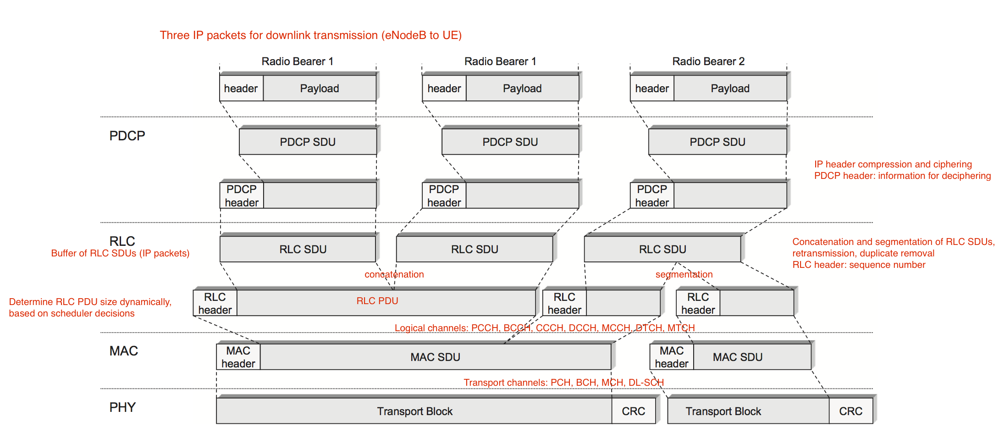
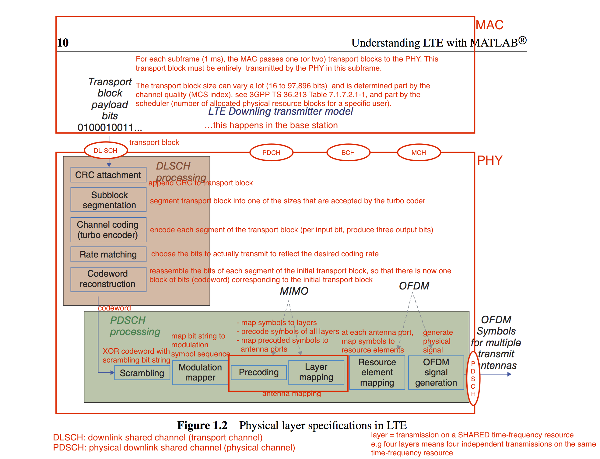
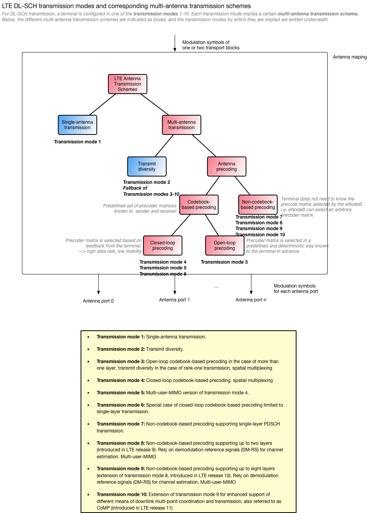

Internal workings of LTE, with special focus on Layer 1 (PHY) and Layer 2 (MAC).

For a list of acronyms, see [Acronyms](#acronyms).

# Protocol Architecture

The layers of the LTE protocol:

{:width="100%"}

A more detailed view:

{:width="100%"}

# Channels

A channel can be seen like a "category" of a piece of data that is passed between protocol layers (and exchanged between network entities).

## Downlink

Channels used by the eNodeB:

{:width="100%"}

## Uplink

Channels used by the UE:

{:width="60%"}{:.center-image}

# Downlink Data Flow

Flow of data packages that an eNodeB sends to an UE:

{:width="100%"}

# DL-SCH Processing in the PHY Layer

This shows what happens when the MAC layer on the eNodeB passes some data to the PHY layer on the DL-SCH channel:

{:width="100%"}

The following shows the same as the above figure, but illustrated differently:

{:width="100%"}

# Transmission Modes

{:width="100%"}

# Acronyms

The following is a list of acronyms that are used in this document:

| |
|:-|:-
| LTE | Long-Term Evolution
| UE  | User Equipment
| MME | Mobility Management Entity
| NAS | Non-Access-Stratum
| RRC | Radio Resource Control
| PDCP | Packet Data Convergence Protocol
| RLC | Radio Link Control
| MAC | Medium Access Control
| PHY | Physical
| CRC | Cyclic Redundancy Check
| HARQ | Hybrid Automatic Repeat Request
| OFDM | Orthogonal Frequency-Division Multiplexing
{:.table-acronym .table-no-thead}

The acronyms of the channels are resolved directly in the figures of the [downlink](#downlink) and [uplink](#uplink) channels.

# References

- [Understanding LTE with Matlab](https://www.mathworks.com/support/books/book90221.html) (source of most figures)
