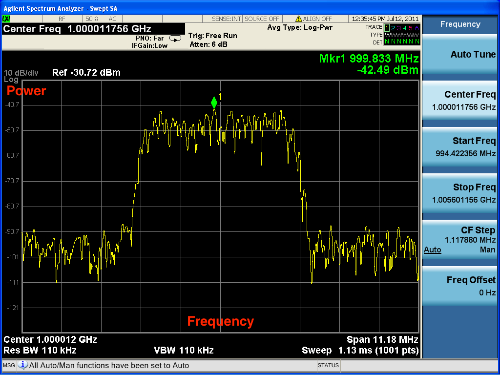
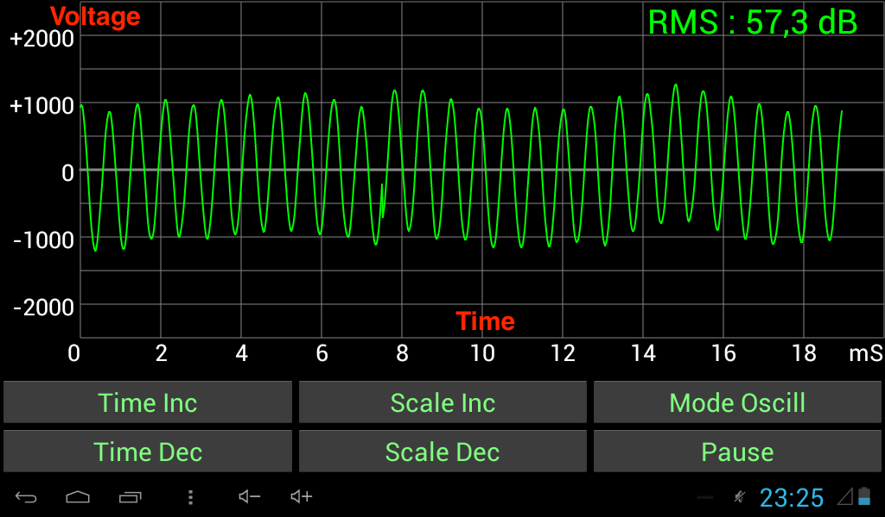
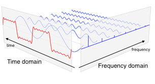
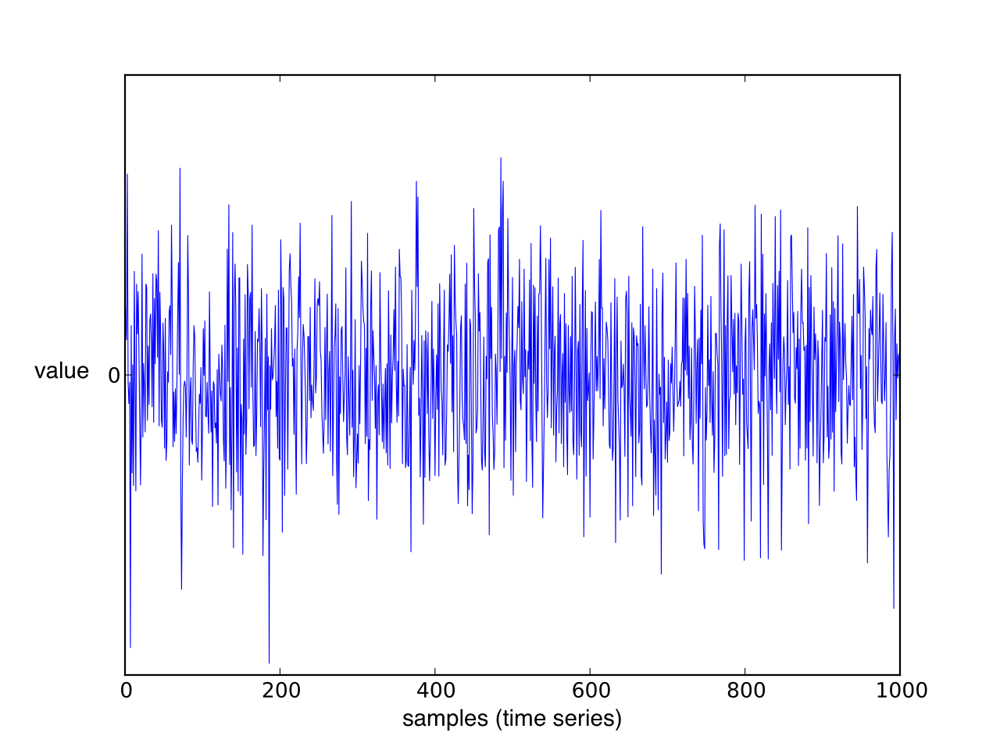

Summary of various concepts that are central to radio communication.

# Contents

- TOC
{:toc .toc-depth-2 .toc-skip-first}

Basic Concepts
==============

- **Channel:** range of frequencies
- **Bandwidth:** measure of width of a channel

Channel Access (Multiple Access)
================================

Sharing of communication channel among different data streams.

Channel Access Schemes
----------------------

- **FDMA (frequency-division multiple access):** different frequency bands for different data streams. There are gaps (guard bands) between these frequency bands. Based on frequency-division multiplexing (FDM).
    - **OFDMA (orthogonal frequency-division multiple access):** signals of different data streams are orthogonal to each other, so that the guard bands can be eliminated. Based on orhogonal frequency-division multiplexing (OFDM).
- **TDMA (time-division multiple access):** different time slots for different data streams. Based on time-division multiplexing (TDM)
- **CDMA (code-division multiple access):** data streams transmitted simultaneously and on some frequency, but each data stream is assigned a code that allows to reconstruct the original signal of each data stream
- **SDMA (space-division multiple access):** different physical areas for different data streams

Duplexing
=========

Sharing of communication channel among the two directions of a data stream.

Duplexing types
---------------

- **Simplex:** only one-way transmission (e.g. radio, TV)
- **Half duplex:** both parties can transmit, but only one at a time (e.g. walkie talkie)
- **Full duplex:** both parties can transmit at the same time (e.g. telephone)

Duplexing methods
-----------------

- **FDD (frequency-division duplexing):** uplink and downlink on different frequencies
- **TDD (time-division duplexing):** uplink and downlink on same frequency, but only one at a time (emulating full duplex over a half duplex link)

Duplexing in UMTS
-----------------

Both, FDD and TDD, ar specified by 3GPP. However, FDD is the commonly used method, and TDD is used only for niche applications.

Duplexing in LTE
----------------

As for UMTS, both, FDD and TDD, are specified by 3GPP, however, FDD is the commonly used one.

Modulation
==========

"Pack" information to be transmitted onto an analog carrier signal.

Analog Modulation
-----------------

The information to be transmitted is an analog signal.

- **AM (amplitude modulation):** amplitude of carrier signal is varied
- **FM (frequency modulation):** frequency of carrier signal is varied
- **PM (phase modulation):** phase shift of carrier signal is varied

Digital Modulation
------------------

The information to be transmitted is a bit stream.

Based on keying: the final modulated signal has a finite number of discrete states that represent a finite number of digital symbols. A symbol is a finite-length sequence of bits. For example, if the symbols are 8 bits long, there are 256 different symbols, and thus 256 distinct states of the final modulated signal.
 
- **PSK (phase-shift keying):** distinct phase shift for each symbol
- **FSK (frequency-shift keying):** distinct frequency for each symbol
- **ASK (amplitude-shift keying):** distinct amplitude for each symbol
- **QAM (quadrature amplitude modulation):** combination of PSK and ASK

Signal Measures
===============

- **RSSI (received signal strength indicator):** total power received by the antenna
- **RSRP (reference symbol received power):** average received power from the resource elements that carry reference symbols. Measures power from specific antenna sector by excluding noise and interference from other sectors. Used in LTE.
- **RSRQ (reference signal received quality):** (N*RSRP)/RSSI, with N = number of resource blocks over which RSSI is measured. Used in LTE.
- **RSCP (received signal code power):** received power from a specific data stream, distinguished by a CDMA code. Used in UMTS.

Spectrum Analyzer
=================

Observe magnitude of a signal with respect to frequency.

-   X-axis: frequency
-   Y-axis: amplitude

{:width="50.00000%"}{:.center-image}

**Sources:**

-   <https://en.wikipedia.org/wiki/Spectrum_analyzer>

Oscilloscope
============

Observe change of a signal with respect to time

{:width="50.00000%"}{:.center-image}

-   X-axis: time
-   Y-axis: voltage

**Sources:**

-   <https://en.wikipedia.org/wiki/Oscilloscope>

Frequency Domain vs. Time Domain
================================

Frequency domain:

-   X-axis frequency
-   Y-axis magnitude of signal at this frequency

Time domain:

-   X-axis time
-   Y-axis magnitude of signal at this time

{:width="30.00000%"}{:.center-image}

**Sources:**

-   <https://en.wikipedia.org/wiki/Frequency_domain>

Time Series
===========

Sequence of data points.

-   X-axis: time
-   Y-axis: measured values

Spectral Analysis
=================

Describe time series by comparing them to sines an cosines.

Given a time series, figure out how to construct it using sines and
cosines (*Fourier representation* for a time series).

**Sources:**

-   <https://faculty.washington.edu/dbp/PDFFILES/GHS-AP-Stat-talk.png>

Fourier Analysis
----------------

study of the way general functions may be represented or approximated by
sums of simpler trigonometric functions

The decomposition process itself is called a Fourier transformation.
Output of transformation is called Fourier transform

**Sources:**

-   <https://en.wikipedia.org/wiki/Fourier_analysis>

Discrete Fourier Transform (DFT)/Fast Fourier Transform (FFT)
-------------------------------------------------------------

Convert time series into combination of sine waves, ordered by their
frequencies

Spectral Power Density (PSD)
----------------------------

Unit: $\frac{\text{Power}}{\text{Frequency component}}$ e.g.
$\frac{W}{Hz}$

Channel Coherence Time
======================

Time during which the attenuation and interference of a channel is
considered as constant.

The channel coherence time $T_c$ is inversely related to $D_s$, the :
$T_c \approx \frac{1}{D_s}$

**Sources:**

-   <https://en.wikipedia.org/wiki/Coherence_time_(communications_systems)>
-   <https://en.wikipedia.org/wiki/Fading#Slow_versus_fast_fading>

Doppler Spread
==============

In a multipath scenario, different paths of the same signal may have
different Doppler shifts (change in frequency due to velocity of
transmitter of receiver). The range of these Doppler shifts is the
Doppler spread.

Doppler spread negatively affects .

-   <https://en.wikipedia.org/wiki/Fading#Slow_versus_fast_fading>

Fading
======

Variation of attenuation of a signal.

May vary with:

-   Time
-   Position
-   Frequency

May be induced by:

-   Multipath propagation
-   Shadowing

Can be combated by diversity (multiple antennas at receiver and/or
transmitter).

**Sources:**

-   <https://en.wikipedia.org/wiki/Fading>

Multipath-Induced Fading vs. Shadow Fading
------------------------------------------

**Multipath-induced fading:** receiver sees superposition of copies of
the transmitted signal. Each copy experiences a different attenuation,
delay, and phase shift. This can result in either constructive or
destructive interference, and amplification or attenuation of the
signal.

**Shadow fading:** signal attenuated at certain locations or frequencies
to to obstacles causing shadowing.

Slow Fading vs. Fast Fading
---------------------------

**Slow fading:** large coherence time with respect to delay requirements
of application. Attenuation and interference can be regarded as static
over the period of use (e.g. data session, call).

**Fast fading:** small coherence time of channel with respect to delay
requirements of application. Attenuation and interference vary over
period of use (e.g. data session, call).

Frequency-Selective Fading
--------------------------

Different frequency components of a signal experience different
attenuation and interference.

Equivalent to time dispersion (signal energy associated with each symbol
is spread out in time).

In OFDM frequency-selective fading is mitigated because bandwidth is
divided into narrow subcarriers that are smaller than the
frequency-selective fading granularity.

**Sources:**

-   <https://en.wikipedia.org/wiki/Fading#Selective_fading>

Noise-Limited vs. Interference-Limited Scenarios
================================================

**Noise-limited scenario:** noise is the main source of radio link
impairment (i.e. lack of interference)

**Interference-limited scenario:** interference is the main source of
radio link impairment

Channel Coding
==============

Replication of information bits as one or more code bits (i.e.
introduction of redundancy).

$$\text{Code rate} = \frac{\text{Information bits}}{\text{Total bits}}$$

-   Code rate close to 1: very little redundancy
-   Code rate close to 0: very much redundancy

Noise
=====

Thermal Noise (Johnson–Nyquist Noise)
-------------------------------------

Noise that is intrinsic to the conductor even without any applied
voltage. Generated by the thermal agitation of the charge carriers
(usually the electrons) inside the conductor.

The power of thermal noise depends on the temperature of the carrier:
the higher the temperature, the higher the power.

Thermal noise is approximately “white” (see [White Noise](#white-noise)).

**Sources:**

-   <https://en.wikipedia.org/wiki/Johnson%E2%80%93Nyquist_noise>
-   <http://www.physics.utoronto.ca/~phy225h/experiments/thermal-noise/Thermal-Noise.png>

White Noise
-----------

Random signal with a constant power spectral density.

**Sources:**

-   <https://en.wikipedia.org/wiki/White_noise>

Additive White Gaussian Noise (AWGN)
------------------------------------

White noise with each sample (time series point) having a normal
distribution with zero mean.

-   **Additive** because it is added to any noise that might be
    intrinsic to the information system
-   **White** because it has uniform power across the frequency band for
    the information system
-   **Gaussian** because each sample has a normal distribution with zero
    mean

{:width="50.00000%"}{:.center-image}
*Figure: Gaussian white noise signal (time series).*{:.caption}

**Sources:**

-   <https://en.wikipedia.org/wiki/Additive_white_Gaussian_noise>
