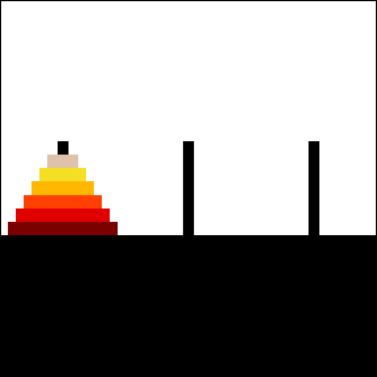

# The Power of Recursion

The [Towers of Hanoi](https://en.wikipedia.org/wiki/Tower_of_Hanoi) problem consists in moving all the disks from the first tower to the last tower in the same order, under the following constraints:

1. Only one disk can be moved at a time
2. A disk cannot be placed on top of a smaller disk

The recursive solution is extremely easy, for example, in Java:

~~~java
void hanoi(int n, Stack<Integer> start, Stack<Integer> tmp, Stack<Integer> dest) {
    if (n <= 0) return;              // Base case, no disks to move
    hanoi(n-1, start, dest, tmp);    // Move disks on top of largest disk to "tmp"
    dest.push(start.pop());          // Move largest disk to "dest"
    hanoi(n-1, tmp, start, dest);    // Move disks on "tmp" to "dest"
}
~~~

These are 4 lines of code doing the following (example of *n* = 6 disks):

{:.center-image}{:width="40%"}
*Source:&nbsp;[Wikipedia](https://commons.wikimedia.org/wiki/File:Iterative_algorithm_solving_a_6_disks_Tower_of_Hanoi.gif#/media/File:Iterative_algorithm_solving_a_6_disks_Tower_of_Hanoi.gif)*{:.caption}

There are $2^n-1$ moves.

Good luck implementing this iteratively!

# Recursion

A function that calls itself with different arguments.

# Dynamic Programming

Dividing a problem into subproblems, solving the subproblems, and and caching ther results. When the result of a subproblem that has already been solved is needed again, it is read from the cache (instead of solved again).

# Recursion vs. Iteration

Every recursive algorithm can be implemented iteratively.

## Advantages and Disadvantages of Recursion

- **Advantages**
    - Often the implementation is simple and elegant compared to an iterative implementation
- **Disadvantages**
    - Space-inefficient: every recursive call adds a layer to the function call stack. If the input is too large, this results in a *stack overflow* (e.g. `StackOverflowError`in Java ). 

## Advantages and Disadvantages of Iteration

- **Advantages**
    - Space-efficient: only a constant number of variables is needed to iterte through the input
- **Disadvantages**
    - Often more verbose and complex to implement.

# Dynamic Programming vs. Recursion

Often a recursive algorithm with an exponential time complexity can be reduced to linear time complexity by the means of dynamic programming.

The reason is that recursive algorithms often calculate the same subproblems again and again.

Dynamic programming cuts off these unnecesary calculations by caching the results of all subproblems, so that each subproblem is calculated only once.

# Example

## Fibonacci Iterative

## Fibonacci Recursive

## Fibonacci with Top-Down Dynamic Programming (Memoisation)

## Fibonacci with Bottom-Up Dynamic Programming

# Dividing a Problem Into Subproblems

## Bottom-Up Approach

- Start at the base cases
- From each known case, construct the subsequent case

## Top-Down Approach

